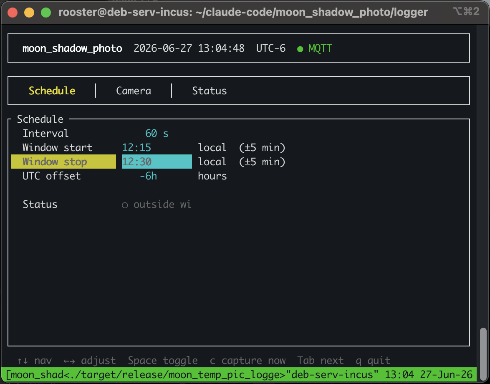
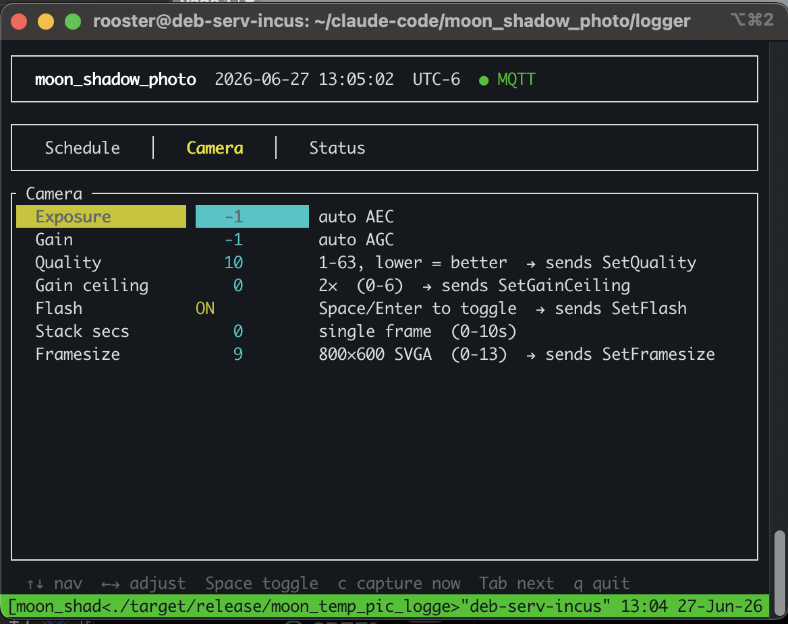

# moon_shadow_photo — ESP32-CAM Nighttime Photo Logger

*An AI-Thinker ESP32-CAM-MB capturing the night sky under moonlight, controlled over MQTT with frame-stacking for low-light exposure.*

---

## Overview

`moon_shadow_photo` is a periodic low-light photography system built around the **AI-Thinker ESP32-CAM-MB** board. The camera wakes up on an MQTT trigger, applies per-capture exposure and gain settings, optionally stacks multiple frames for longer effective exposure, then HTTP POSTs the JPEG to a host logger for date-organized storage.

The whole stack is written in Rust — firmware using the ESP-IDF std layer, logger as a native binary with a terminal TUI.

```
┌─────────────────────┐      MQTT senddata      ┌──────────────────────┐
│   moon_temp_pic_    │ ──────────────────────▶ │   ESP32-CAM-MB       │
│   logger            │                          │   (OV2640 / PSRAM)   │
│   (debserver)       │ ◀────────────────────── │                      │
│   axum HTTP :8765   │      HTTP POST JPEG      │   Rust / ESP-IDF     │
│   ratatui TUI       │                          │   std, xtensa LX6    │
└─────────────────────┘                          └──────────────────────┘
         │
         ▼
  /home/rooster/pic_logs/
    YYYY-MM-DD/
      20260626_214833_000.jpg
      20260626_214933_001.jpg
```

---

## Hardware

**Board:** AI-Thinker ESP32-CAM-MB
**SoC:** ESP32 (Xtensa LX6 dual-core, 240 MHz)
**Camera:** OV2640 (2MP, I²C address 0x30)
**PSRAM:** 8 MB (required — OV2640 framebuffer at SVGA exceeds IRAM)
**Flash:** 4 MB
**Red LED:** GPIO33 (active LOW — driven HIGH at boot to suppress it)
**Flash LED:** GPIO4 (active HIGH — not used; flash is disabled, see below)
**WiFi:** Internal antenna (weak) or external SMA antenna — **external required for reliable range**

### OV2640 Pin Map (AI-Thinker)

```
PWDN=32  RESET=-1  XCLK=0   SIOD=26  SIOC=27
D7=35    D6=34     D5=39    D4=36    D3=21
D2=19    D1=18     D0=5
VSYNC=25  HREF=23  PCLK=22
```

### PWDN (GPIO32) — critical for camera reinit

After `esp_camera_deinit()`, the driver releases GPIO32 to high-Z. The AI-Thinker board has **no external pullup** on PWDN, so the OV2640 never actually power-cycles; probe on reinit reads stale mode registers and returns `ESP_ERR_NOT_SUPPORTED (0x106)`.

Fix: explicitly drive PWDN HIGH after every deinit:

```rust
fn hold_pwdn_high() {
    unsafe {
        let _ = esp_idf_sys::gpio_set_direction(32, gpio_mode_t_GPIO_MODE_OUTPUT);
        let _ = esp_idf_sys::gpio_set_level(32, 1);
    }
}
```

Call `hold_pwdn_high()` + 1000 ms delay before every reinit.

---

## Firmware

### Toolchain

Standard ESP Rust toolchain (`channel = "esp"`) — the Xtensa-patched rustc.

```toml
# rust-toolchain.toml
[toolchain]
channel = "esp"
```

```toml
# .cargo/config.toml
[target.xtensa-esp32-espidf]
linker = "ldproxy"
runner = "tools/flash.sh"

[build]
target = "xtensa-esp32-espidf"

[env]
ESP_IDF_VERSION = "v5.3"
MCU = "esp32"
```

### Build & Flash

```bash
cd firmware
cargo run --release   # compiles, flashes, provisions config, opens monitor
                      # press Ctrl+R when monitor opens to boot the device
espflash monitor      # monitor only (device already flashed)
```

The runner (`tools/flash.sh`) does three things in sequence:
1. `espflash flash --partition-table partitions.csv --no-reset` — flash firmware, leave device in stub mode
2. `python3 tools/provision.py --flash` — write config to `0x3F0000` while device is still in stub
3. `espflash monitor` — open serial monitor; press **Ctrl+R** to boot

`--no-reset` prevents a race condition where the device would boot before the config is written, see the blank partition, panic, and enter a boot loop.

**In the field (no USB):** the device auto-boots normally on power-on. No intervention required.

### Provisioning

Credentials live in a dedicated 4 KB config partition at `0x3F0000` (top of 4 MB flash — safe from app growth). The config is a length-prefixed JSON blob with an 8-byte magic header (`[0xFA, 0x12, 0xC3, 0x7A]`).

```bash
# Edit tools/provision.py then:
python3 tools/provision.py --flash

# Reprovision without reflashing firmware:
espflash erase-region 0x3F0000 0x1000
espflash write-bin 0x3F0000 tools/config.bin
```

`provision.py` config dict (current defaults):
```python
CONFIG = {
    "wifi_ssid":    "Shop",
    "wifi_pass":    "...",
    "mqtt_host":    "10.0.0.50",
    "mqtt_port":    1883,
    "device_id":    "moon-shadow-001",
    "framesize":    9,          # 9=SVGA 800×600
    "jpeg_quality": 10,         # lower = better quality (OV2640 convention)
    "gain_ceiling": 0,          # 0=2× max auto gain
    "upload_host":  "10.0.0.50",
    "upload_port":  8765,
}
```

### Partition Table

```csv
# partitions.csv
nvs,      data, nvs,     0x9000,   0x6000,
phy_init, data, phy,     0xF000,   0x1000,
factory,  app,  factory, 0x10000,  0x3E0000,
config,   data, 0x06,    0x3F0000, 0x1000,
```

Use subtype `0x06` (Undefined), not `0xFF` — `esp-idf-part` panics on `0xFF`.

### Architecture

| File | Role |
|------|------|
| `main.rs` | WiFi init, SNTP sync, camera init, MQTT session loop, capture orchestration |
| `config.rs` | Flash-backed config: reads/writes JSON at `0x3F0000` |
| `camera.rs` | Manual FFI bindings for `espressif/esp32-camera` component |
| `types.rs` | Serde structs for all MQTT payloads |

### MQTT Session — Two-Thread Pattern

`EspMqttClient` deadlocks if `subscribe()` is called from the same thread as `connection.next()` — the ESP-IDF MQTT library holds an internal API lock during TCP receive. Fix: two threads.

```
Thread A (event loop):           Thread B (main logic):
connection.next() ──────────▶  channel.recv()
  Connected ──────────────▶    subscribe(senddata_topic)
  Received  ──────────────▶    subscribe(cmd_topic)
  Disconnected (log, continue)  publish(hello, retained)
                                capture / upload loop
```

Events decoded into owned `Ev` enum (String/Vec<u8>) before channel send — the event (internal buffer reference) is dropped before the send.

### Camera FFI

`bindgen` fails on macOS against `esp_camera.h` (Apple clang include-depth limit). All types written manually in `camera.rs`. Key gotchas:

- `CameraStatus.framesize` is `u32` (C enum = `int` = 4 bytes)
- `CameraFb.timestamp` is `[i32; 2]` (newlib `timeval` = two `long` = two `i32` on ESP32)
- `CameraConfig` has `grab_mode` field — must be `CAMERA_GRAB_LATEST` for JPEG idle mode

### Camera Grab Mode — GRAB_LATEST (important)

With `CAMERA_GRAB_WHEN_EMPTY` (the default), the DMA ring has exactly one slot. If idle JPEG frames overflow that slot (bright scene, high quality setting), the DMA fills permanently and every subsequent `fb_get` times out — camera dies until reboot.

Fix: all JPEG inits use `fb_count=2` + `CAMERA_GRAB_LATEST`. GRAB_LATEST overwrites the oldest buffer continuously, so the DMA never stalls regardless of how many frames overflow.

Grayscale stacking keeps `GRAB_WHEN_EMPTY` + `fb_count=1` to precisely control frame accumulation timing.

```rust
fn jpeg_config(framesize: u8, quality: u8) -> CameraConfig {
    make_config(framesize, quality, PIXFORMAT_JPEG, 2, CAMERA_GRAB_LATEST)
}
```

### Flash LED — Disabled

The white flash LED (GPIO4) is permanently off. Attempting to toggle it via MQTT triggered a boot loop: `config::save()` wrote a `vec![]` to flash, the Vec landed in PSRAM, `esp_partition_write` rejected the PSRAM pointer, the erase had already happened, the partition was left blank, and every subsequent boot saw no magic bytes → panic → WDT reset → loop.

The underlying bug (PSRAM vec for flash write) has been fixed (stack-allocated buffer now), but flash is not needed for nighttime photography so it has been removed entirely. `SetFlash` cmd is not handled. GPIO4 stays LOW.

### Status LED Patterns

GPIO4 (flash LED) also doubles as a boot status indicator before any capture is triggered:

| Pattern | Meaning |
|---------|---------|
| 2 blinks | WiFi up |
| 3 blinks | MQTT connected + hello published |
| 8 rapid blinks | Session error (5s before retry) |

---

## Hard-Won Build & Runtime Lessons

### 1. Partition table absolute path required

`CONFIG_PARTITION_TABLE_CUSTOM_FILENAME` in `sdkconfig.defaults` is resolved relative to embuild's `out/` directory. Relative paths silently fail.

```
# CORRECT
CONFIG_PARTITION_TABLE_CUSTOM_FILENAME="/Users/dek/claude_projects/moon_shadow_photo/firmware/partitions.csv"
```

### 2. 4 MB flash size must be declared

Without `CONFIG_ESPTOOLPY_FLASHSIZE_4MB=y`, `gen_esp32part.py` defaults to 2 MB and rejects any offset beyond 2 MB.

### 3. espflash won't update the partition table by default

`espflash flash` only flashes the app ELF unless `--partition-table partitions.csv` is passed.

### 4. espflash panics on subtype `0xFF`

`esp-idf-part 0.6.0` calls `DataType::from_repr(0xFF).unwrap()` — panics. Use `0x06`.

### 5. rumqttc doesn't work on ESP-IDF

Tokio's I/O reactor calls `epoll_create` → `EACCES` on ESP-IDF (no epoll). Use `EspMqttClient` from `esp-idf-svc`.

### 6. Xtensa LLVM rejects f32 in serde_json deserialization

`serde_json` deserializing `f32` generates `[-1.0f32, 1.0f32]` constant pools that trigger:
```
LLVM ERROR: Cannot select: XtensaISD::PCREL_WRAPPER TargetConstantPool [float -1.0, 1.0]
```
Use `u32`/`i32` for all JSON-deserialized numeric fields. Cast to `f32` after deserialization in code if needed.

### 7. PSRAM buffer forbidden for esp_partition_write

`esp_partition_write` uses SPI DMA for the write — DMA cannot access PSRAM on ESP32. The source buffer **must be in internal DRAM**. A `vec![]` heap allocation can land in PSRAM when DRAM is tight.

Fix: stack-allocate the write buffer. The main-task stack is always in DRAM.

```rust
// WRONG — vec may land in PSRAM
let mut buf = vec![0xFFu8; aligned];

// CORRECT — stack array, always DRAM on the main task
let mut buf = [0xFFu8; HEADER_SIZE + MAX_JSON + 4];
```

### 8. PWDN float after deinit causes 0x106 on reinit

See Hardware section above. Always call `hold_pwdn_high()` + 1000 ms after `esp_camera_deinit()`.

### 9. Flash + provision race condition

`espflash flash` without `--no-reset` auto-boots the device. The firmware boots, can't find config, panics, and enters a restart loop before `provision.py` can write the config partition. Use `--no-reset` to keep the device in stub mode until provisioning is complete.

### 10. MALLOC_CAP_SPIRAM value

`MALLOC_CAP_SPIRAM = (1 << 10) = 0x400`. The value `0x200` is `MALLOC_CAP_PID7` — wrong cap flag causes `heap_caps_malloc` to silently return null.

---

## OV2640 Exposure & Gain

The OV2640 is a video sensor, not a scientific imager. Exposure is set in **AEC lines** (sensor integration periods), not seconds.

At SVGA (800×600) with default PLL (`pclk_div=8`):
- One line ≈ 694 µs
- AEC max (1200) ≈ **800–850 ms per frame** (sensor inserts dummy lines)
- Effective frame rate at AEC 1200: **~1–2 fps**

Rough ISO equivalents (with `gain_ceiling=6` = 128× max):

| `agc_gain` | Approx multiplier | Rough ISO equiv |
|-----------|-------------------|-----------------|
| 0         | 1×                | ~100            |
| 10        | ~10×              | ~1000           |
| 13        | ~16×              | ~1600           |
| 20        | ~40×              | ~4000           |
| 30        | 128×              | ~12800          |

### MQTT Senddata Payload

```json
{ "exposure": 1200, "gain": 13, "stack_secs": 5 }
```

- `exposure`: AEC lines, 0–1200. `-1` = auto AEC.
- `gain`: AGC gain, 0–30. `-1` = auto AGC.
- `stack_secs`: 0 = single frame. 1–10 = frame-stack for N seconds.

---

## Frame Stacking

Maximum single-frame exposure is ~850 ms. For longer effective exposures the firmware implements **frame averaging**:

1. Deinit JPEG camera, `hold_pwdn_high()` + 1000 ms
2. Reinit in `PIXFORMAT_GRAYSCALE`, `GRAB_WHEN_EMPTY`, `fb_count=1`
3. Re-apply manual `exposure` / `gain` via `apply_sensor()`
4. Drain 8 frames to let AEC disable take effect (OV2640 needs ~5 frames for register writes)
5. Measure actual fps (3 test frames), calculate `n_frames = round(stack_secs × fps)`
6. Capture `n_frames` frames, accumulate into `u32` PSRAM buffer (~1.9 MB at SVGA)
7. Divide by frame count → normalised `u8` grayscale image
8. Encode to JPEG with `fmt2jpg()` from the `esp32-camera` component
9. Deinit, `hold_pwdn_high()` + 1000 ms, reinit JPEG GRAB_LATEST mode

**Quality note:** The stacked result uses raw sensor data encoded with the software JPEG encoder. It will look "flatter" than a single-frame hardware JPEG (which has the OV2640's on-chip sharpening, AWB, and gamma pipeline active). This is correct for astrophotography — the raw pipeline preserves faint-object detail that the hardware post-processor would over-sharpen or clip.

```
Stack example log:
▶ capture: exposure=1200, gain=13, stack_secs=10
Stacking 15 frames at 1.52 fps ≈ 9.9s
Stack: 15 frames  800×600  (480000 px/frame)
Stack result: 28431 bytes JPEG
```

---

## Logger

The host logger (`moon_temp_pic_logger`) runs on debserver (10.0.0.50):

- Publishes `senddata` MQTT commands on the configured interval within a local-time window (overnight wrap handled)
- Runs an axum HTTP server on port 8765 to receive and save JPEG uploads
- Detects truncated JPEGs (missing `FF D9` EOI marker) and logs a warning
- **ratatui terminal TUI** for live adjustment

### TUI Screenshots

**Schedule tab** — controls the capture window and interval. The header shows device name, current time, timezone, and MQTT connection state (green = connected). `Window start` and `Window stop` are local-time boundaries; captures are skipped outside the window. `Status` reads `outside window` during the day; switches to `ACTIVE — next capture in Ns` when inside the window.



**Camera tab** — adjusts per-capture sensor settings sent in the `senddata` payload and persistent device config sent via `cmd` MQTT. The hint column shows the range, effect, and which MQTT command each field generates. Selected field is highlighted in yellow (label) and cyan (value). The Flash row shown here reflects an earlier version; flash has since been removed (see Flash LED section above).



### Running the Logger

```bash
# Sync source (skip target/)
rsync -av --exclude target /Users/dek/claude_projects/moon_shadow_photo/logger/ \
  rooster@10.0.0.50:/home/rooster/claude-code/moon_shadow_photo/logger/

# Build and run on debserver
ssh rooster@10.0.0.50
cd /home/rooster/claude-code/moon_shadow_photo/logger
cargo build --release
./target/release/moon_temp_pic_logger
```

If the HTTP server reports "Address already in use", kill the old process:
```bash
pkill moon_temp_pic_logger
```

### TUI Tabs

**Tab: Schedule**

```
  Interval      [  60] s
  Window start  [20:00] local
  Window stop   [06:00] local
  UTC offset    [  -7]         ← MDT example

  Status: ● ACTIVE — next capture in 42s
```

**Tab: Camera** (settings sent to ESP32 via MQTT cmd on change)

```
  Exposure      [  -1] (auto AEC)          ← in senddata payload
  Gain          [  -1] (auto AGC)          ← in senddata payload
  Quality       [  10] (1-63, lower = better) → SetQuality
  Gain ceiling  [   0] (0=2× … 6=128×)    → SetGainCeiling
  Stack secs    [   0] (0=single, 1-10s)  ← in senddata payload
  Framesize     [   9] (800×600 SVGA)     → SetFramesize
```

Flash has been removed — it caused WDT boot loops and is not needed for nighttime use.

**Tab: Status** — MQTT connection, last capture time/size, file count, activity log.

Key bindings: `↑↓` navigate · `←→` adjust · `c` manual capture · `Tab` next tab · `q` quit

### Logger config.toml

```toml
broker      = "10.0.0.50"
port        = 1883
client_id   = "moon-shadow-logger"
sensor_id   = "moon-shadow-001"

interval    = 60      # seconds between captures
start_time  = "20:00" # local time
stop_time   = "06:00" # local time

exposure    = -1      # -1=auto, 0-1200=manual AEC lines
gain        = -1      # -1=auto, 0-30=manual gain

quality      = 10
gain_ceiling = 0
stack_secs   = 0
framesize    = 9       # 9=SVGA 800×600
utc_offset_hours = -7

log_dir     = "/home/rooster/pic_logs/logs_photo"
http_port   = 8765
```

### File Layout

```
/home/rooster/pic_logs/logs_photo/
  2026-06-26/
    20260626T214833Z_000.jpg
    20260626T214933Z_001.jpg
  2026-06-27/
    ...
```

---

## MQTT Reference

**Broker:** 10.0.0.50:1883 (mosquitto on debserver)

| Topic | Direction | Payload |
|-------|-----------|---------|
| `moon-shadow-001/senddata` | logger → ESP32 | `{"exposure":-1,"gain":-1,"stack_secs":0}` |
| `moon-shadow-001/cmd`      | any → ESP32    | `{"cmd":"SetQuality","value":10}` |
| `moon-shadow-001/status`   | ESP32 → any   | `{"status":"online","framesize":9,...}` |
| `moon-shadow-001/hello`    | ESP32 → any   | `{"device_id":"moon-shadow-001","msg":"booted",...}` (retained) |

### Supported `cmd` Commands

```bash
# JPEG quality (1-63, lower = better)
mosquitto_pub -h 10.0.0.50 -t 'moon-shadow-001/cmd' -m '{"cmd":"SetQuality","value":10}'

# Max auto gain ceiling (0=2× … 6=128×)
mosquitto_pub -h 10.0.0.50 -t 'moon-shadow-001/cmd' -m '{"cmd":"SetGainCeiling","value":6}'

# Resolution (9=SVGA, 10=XGA, 12=SXGA, 13=UXGA)
mosquitto_pub -h 10.0.0.50 -t 'moon-shadow-001/cmd' -m '{"cmd":"SetFramesize","value":9}'
```

### Manual Trigger Examples

```bash
# Single frame, auto settings
mosquitto_pub -h 10.0.0.50 -t 'moon-shadow-001/senddata' \
  -m '{"exposure":-1,"gain":-1,"stack_secs":0}'

# Manual long exposure, 5-second stack (~ISO 1600)
mosquitto_pub -h 10.0.0.50 -t 'moon-shadow-001/senddata' \
  -m '{"exposure":1200,"gain":13,"stack_secs":5}'

# Maximum sensitivity, 10-second stack
mosquitto_pub -h 10.0.0.50 -t 'moon-shadow-001/senddata' \
  -m '{"exposure":1200,"gain":30,"stack_secs":10}'

# Watch all MQTT traffic
mosquitto_sub -h 10.0.0.50 -t 'moon-shadow-001/#' -v
```

---

## Source Layout

```
moon_shadow_photo/
├── firmware/
│   ├── src/
│   │   ├── main.rs       # WiFi, SNTP, MQTT two-thread loop, capture orchestration
│   │   ├── config.rs     # Flash-backed JSON config at 0x3F0000 (stack-buf write)
│   │   ├── camera.rs     # Manual esp32-camera FFI, frame stacking, GRAB_LATEST
│   │   └── types.rs      # MQTT payload structs (no f32 in deserialized fields)
│   ├── tools/
│   │   ├── provision.py  # Writes config JSON to 0x3F0000
│   │   └── flash.sh      # Runner: flash --no-reset, provision, monitor
│   ├── partitions.csv    # 4-partition table (config at 0x3F0000, subtype 0x06)
│   ├── sdkconfig.defaults
│   ├── Cargo.toml
│   └── rust-toolchain.toml
└── logger/
    ├── src/
    │   ├── main.rs       # TUI, MQTT publisher, HTTP server, file saving
    │   └── config.rs     # TOML config loader
    └── config.toml
```

---

## sdkconfig.defaults (complete)

```
CONFIG_ESP32_SPIRAM_SUPPORT=y
CONFIG_SPIRAM_ALLOW_BSS_SEG_EXTERNAL_MEMORY=y
CONFIG_SPIRAM_ALLOW_STACK_EXTERNAL_MEMORY=y
CONFIG_CAMERA_CORE0=y
CONFIG_MAIN_TASK_STACK_SIZE=16384
CONFIG_ESP_TASK_WDT_TIMEOUT_S=30
CONFIG_FREERTOS_HZ=1000
CONFIG_ESPTOOLPY_FLASHSIZE_4MB=y
CONFIG_PARTITION_TABLE_CUSTOM=y
CONFIG_PARTITION_TABLE_CUSTOM_FILENAME="/Users/dek/claude_projects/moon_shadow_photo/firmware/partitions.csv"
```

---

*Project repo: `git@github.com:rooster-ninja/moon_shadow_log_pics.git`
Deployed logger: `rooster@10.0.0.50:/home/rooster/claude-code/moon_shadow_photo/`*
